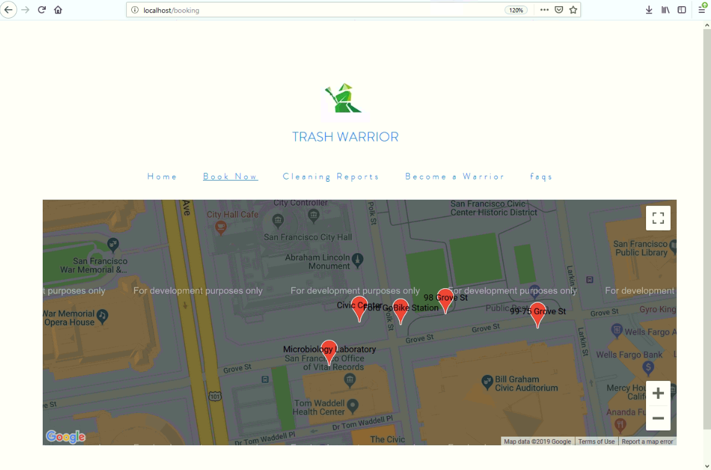

# trash_warrior_ui
Trash Warrior UI



## Install dependencies

First, install all dependencies:

```shell
npm install
```

## Start project locally

```shell
npm run dev
```

## Open localhost in browser
